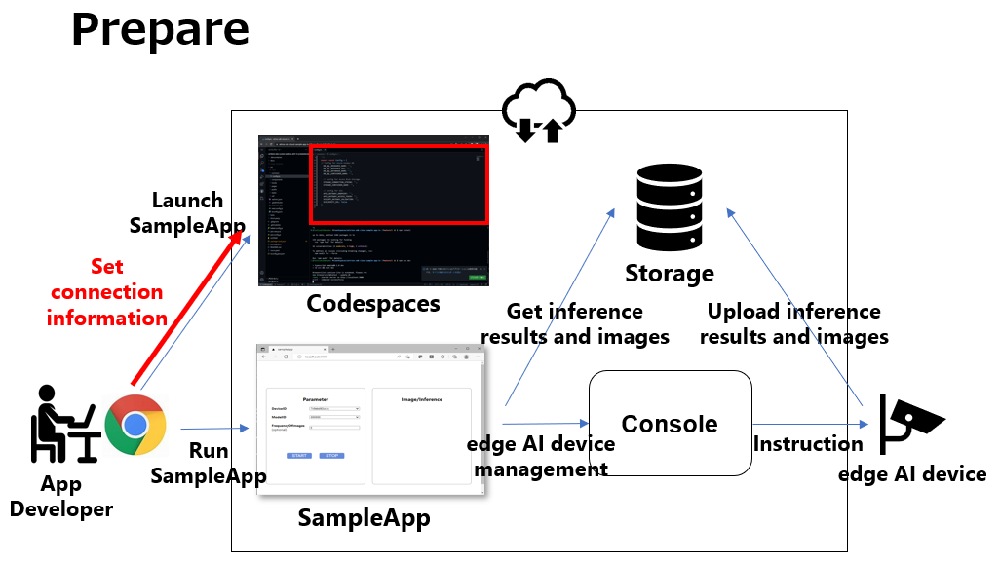
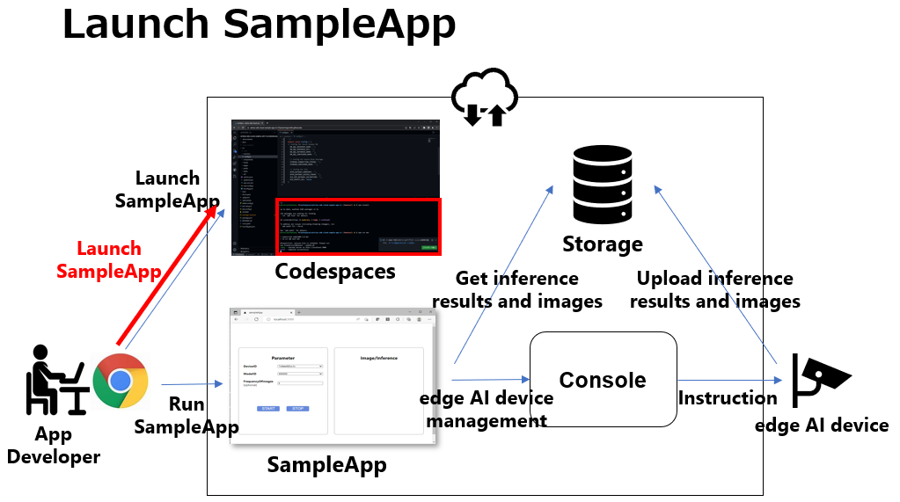
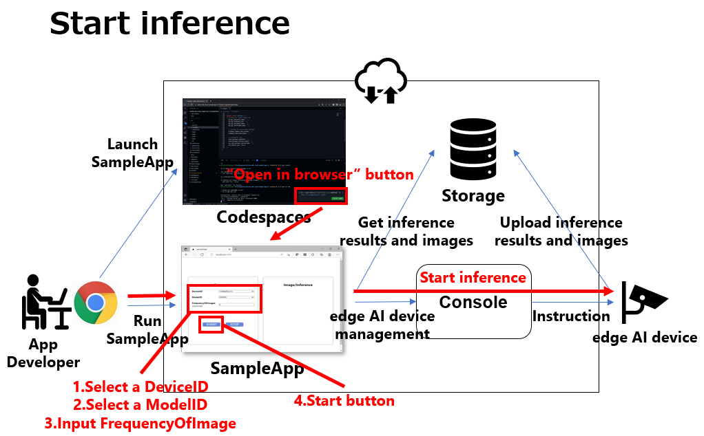
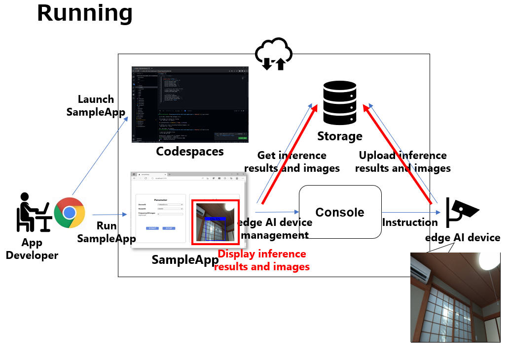
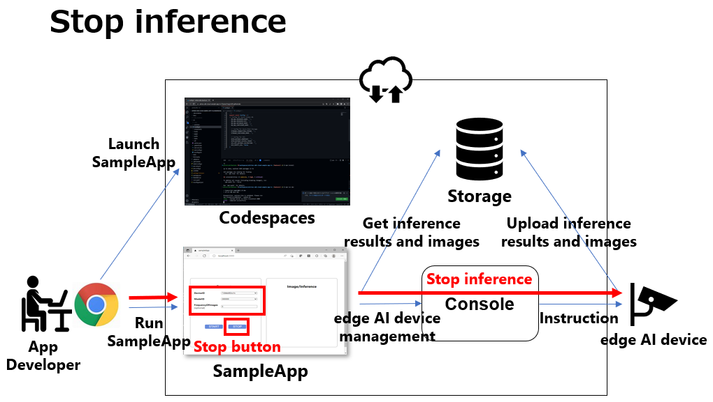

= Cloud SDK pass:[ ] Sample Application pass:[ ] Python pass:[ ] Tutorial pass:[ ] 
:sectnums:
:sectnumlevels: 1
:author: Copyright 2023 Sony Semiconductor Solutions Corporation
:version-label: Version 
:revnumber: x.x.x
:revdate: YYYY - MM - DD
:trademark-desc1: AITRIOS™ and AITRIOS logos are the registered trademarks or trademarks
:trademark-desc2: of Sony Group Corporation or its affiliated companies.
:toc:
:toc-title: TOC
:toclevels: 1
:chapter-label:
:lang: en

== Change history

|===
|Date |What/Why 

|2022/12/12
|Initial draft

|2023/1/30
|Fixed typos + 
Unified the swinging of expressions + 
Fixed the notation + 
Fixed the text size of pictures + 
Updated the PDF build environment +
Removed the [console_access_settings.yaml] from the sample application repository structure +
Changed the procedure for setting the connection information in the "Prepare to run the sample application" +
Changed implementation description for each use case for "**Cloud SDK**" 0.2.0

|2023/5/26
|Fixed the "Reference materials" in "Sample application repository structure" with FlatBuffers version up +
Fixed a lack of FlatBuffers in the "Package (framework) on which the sample application depends" +
Fixed a code misquote in the "Implementation description for each use case" + 
Fixed parenthesis notation for tool names + 
Added alternate text to images
|===

== Introduction
This tutorial explains a sample application using the "**Cloud SDK**". + 
This sample application demonstrates the basic use of the "**Cloud SDK**". + 
You can see how to control an edge AI device using the "**Cloud SDK**" and see the output of the edge AI device uploaded to the "**Console for AITRIOS**" (Hereafter referred to as "**Console**").

[#_precondition]
== Prerequisite
=== Connection information
To use the sample application, you need connection information to access the "**Console**" from the application. + 
The acquired information is used in <<#_Execute_sampleapp,"1.Prepare to run the sample application">>. + 
The required information is as follows:

* Client application details
** Refer to the client application list of "**Portal for AITRIOS**" or register the client application for the sample application if necessary to get the following information: 
See the "Issuing a Client Secret for SDK" in https://developer.aitrios.sony-semicon.com/en/documents/portal-user-manual["**Portal User Manual**"] for more information.
*** Client ID
*** Secret
+
** Get the following information from link:++https://developer.aitrios.sony-semicon.com/en/file/download/rest-api-authentication++[this material]
*** Console endpoint
*** Portal authorization endpoint

=== Edge AI devices
In order for the sample application to work properly, the edge AI device must have specific settings. + 
Required settings are as follows:

* AI model and application are deployed
* AI model based on object detection is deployed
* From the "**Console**" UI, set the Command Parameter File to be used to the following setting:
+

** Mode=1(Image&Inference Result)
** UploadMethodIR="Mqtt"
** Other parameters need to be changed depending on the AI model and application content

== Sample application operating environment
See the https://developer.aitrios.sony-semicon.com/en/file/download/sdk-getting-started/["**SDK Getting Started**"].

== Sample application functional overview
The sample application implements the functionality required to specify an edge AI device enrolled in the "**Console**" and get inference results and images. + 
The following three functions are implemented:

* Get information about edge AI devices enrolled in the "**Console**"
* Instruct edge AI devices to start/stop inference
+
When an inference is started, the edge AI device uploads inference results/images to the "**Console**".
* Get inference results/images from the "**Console**", display gotten inference results and images

== Sample application repository structure
Sample application operating environment is as follows: + 
Omit parts that are not relevant to the implementation.
----
aitrios-sdk-cloud-app-sample-python
├── src (1)
│   ├── __init__.py
│   ├── app.py  (2)
│   ├── common
│   │   ├── __init__.py
│   │   ├── deserialize  (3)
│   │   │   ├── __init__.py
│   │   │   ├── BoundingBox.py
│   │   │   ├── BoundingBox2d.py
│   │   │   ├── GeneralObject.py
│   │   │   ├── ObjectDetectionData.py
│   │   │   └── ObjectDetectionTop.py
│   │   ├── get_client.py  (4)
│   │   └── get_deserialize_data.py  (5)
│   ├── static
│   │   ├── css
│   │   │   ├── Home.module.css  (6)
│   │   │   └── reset.css  (7)
│   │   └── js
│   │       ├── label.json  (8)
│   │       └── sample.js  (9)
│   └── templates
│       └── index.html  (10)
----
(1) src : Sample application folder +
(2) app.py : Main processing of flask application. Implementing functionality with various REST APIs +
(3) deserialize : Folder containing source code to deserialize +
(4) get_client.py : Module to generate a client for the "**Console Access Library**" +
(5) get_deserialize_data.py : Source code to deserialize inference results +
(6) Home.module.css : Sample application frontend style sheet +
(7) reset.css : Sample application frontend style sheet +
(8) label.json : Inference result display label +
(9) sample.js : JavaScript logic running in the frontend UI of the sample application +
(10) index.html : Sample application frontend UI

=== Source code commentary

The following figure provides an overview of the sample application:

image::diagram_python.png[alt="Overview of the sample application", width="400", align="center"]

The sample application consists of the Flask framework.

Call the "**Cloud SDK**" from the sample application to control the edge AI device through the "**Console**". + 
Data from edge AI devices is stored in the "**Console**". + 
Sample application uses the "**Cloud SDK**" to get data from the "**Console**".

=== Package (framework) on which the sample application depends

* "**Console Access Library**"
* https://flask.palletsprojects.com/en/2.2.x/[Flask]
* https://google.github.io/flatbuffers/[FlatBuffers]

[#_Execute_sampleapp]
== How to run the sample application
Use the connection information prepared in the <<#_precondition,"Prerequisite">>

=== 1.Prepare to run the sample application
Create the [console_access_settings.yaml] under the [src/common] on Codespaces and set the connection information.

|===
|src/common/console_access_settings.yaml
a|
[source, Yaml]
----
console_access_settings:
  console_endpoint: "Console endpoint"
  portal_authorization_endpoint: "Portal authorization endpoint"
  client_secret: "Secret"
  client_id: "Client ID"
----
|===
* Specify the gotten console endpoint in `**console_endpoint**`. +
* Specify the gotten portal authorization endpoint in `**portal_authorization_endpoint**`. +
* Specify the secret of the registered application to the `**client_secret**`. +
* Specify the client ID of the registered application to the `**client_id**`. +

IMPORTANT: The combination of the client ID and secret is access information to the "**Console**". + 
Do not publish or share with others and handle with care.
  
NOTE: To run the sample application in a proxy environment, set the `**https_proxy**` environment variable.

=== 2.Launch the sample application
From the Codespaces terminal, install the package and launch the sample application.

....
$ pip install .
$ python src/app.py
....

=== 3.Start inference
Start inference by launching sample application in the browser from the Codespaces dialog.

. Select a Device ID from the list of [**DeviceID**]
. Click the [**START**] to start inference for the edge AI device

=== 4.Review inference results and images
While inference is starting, the "**Image/Inference**" area displays an image and inference results.

=== 5.Stop inference
Click the [**STOP**] in the sample application to stop inference for the edge AI device.

== Implementation description for each use case

=== 1.Get information about edge AI devices enrolled in the "**Console**"

To use the "**Console**", generate a Client for the "**Cloud SDK**". + 
Use the functions provided by the "**Console**" from the generated Client.

* Import library 
+

[source, Python]
----
from console_access_library.client import Client
from console_access_library.common.config import Config
----
Import the libraries required for "**Cloud SDK**" client generation, as preceding.

* "**Cloud SDK**" client generation
+
[source, Python]
----
def get_console_client():
  config_obj = Config(
        console_endpoint,
        portal_authorization_endpoint,
        client_id,
        client_secret
  )
  client_obj = Client(config_obj)
  return client_obj
----
In the preceding source code, generate the client for the "**Cloud SDK**". + 
Specify the connection information to the `**Config**` and generate the `**config_obj**`. + 
Specify the `**config_obj**` to the `**Client**` and generate the `**client_obj**`.

* Get device information
+
[source, Python]
----
def get_devices():
  client_obj = get_console_client()
  client_obj.device_management.get_devices()
----
Call the `**get_console_client**` to generate the `**client_obj**` as preceding. + 
Get device information using the `**get_devices**` provided by the `**device_management**` of the `**client_obj**`.

* Get device parameters
+
[source, Python]
----
def get_command_parameter_file():
  client_obj = get_client.get_console_client()
  return client_obj.device_management.get_command_parameter_file()
----
Call the `**get_console_client**` to generate the `**client_obj**` as preceding. + 
Get device parameters using the `**get_command_parameter_file**` provided by the `**device_management**` of the `**client_obj**`.

=== 2.Instruct the edge AI devices to start inference

* Start inference
+
[source, Python]
----
def start_upload_inference_result():
  client_obj = get_console_client()
  return client_obj.device_management.start_upload_inference_result(device_id="device_id")
----
Call the `**get_console_client**` to generate the `**client_obj**` as preceding. +
Start inference using the `**start_upload_inference_result**` provided by the `**device_management**` of the `**client_obj**`.

=== 3.Get inference results and images from the "**Console**"

Use the functionality provided by client to get inference results and images from the "**Console**".

* Get an image list
+
[source, Python]
----
def get_images():
  client_obj = get_console_client()
  return client_obj.insight.get_images(device_id="device_id", sub_directory_name="sub_directory_name", number_of_images=1, order_by="DESC")
----
Call the `**get_console_client**` to generate the `**client_obj**` as preceding. + 
Get the image list using the `**get_images**` provided by the `**insight**`. +

* Get the latest image and link it to the inference result
+
[source, Python]
----
  client_obj = get_client.get_console_client()
  image_response = client_obj.insight.get_images(device_id, sub_dir, number_of_images=1, order_by="DESC")
  latest_image_data = "data:image/jpg;base64," + image_response["images"][0]["contents"]
  latest_image_ts = image_response["images"][0]["name"].replace(".jpg", "")
----
The preceding source code gets the latest image information from an image list. + 
Get the latest image data into the `**latest_image_data**`. + 
Get the timestamp of the latest image into the `**latest_image_ts**`. + 
Inference results and images are linked by their respective timestamps. + 
Call the function to get inference results linked to images using the `**latest_image_ts**`.

* Get inference results linked to the latest image
+
[source, Python]
----
def get_inference_results():
  client_obj = get_console_client()
  inference_list = client_obj.insight.get_inference_results(device_id="device_id", number_of_inference_results=1, raw=1, time=latest_image_ts)
  return inference_list
----
Call the `**get_console_client**` to generate the `**client_obj**` as preceding. + 
Get the list of inference results using the `**get_inference_results**` provided by the `**insight**`. + 
Specify the number of inference results to get by the `**number_of_inference_results**`. + 
`**raw**` is the argument for accessing the stored inference result. + 
Specify the timestamp of inference results to get by the `**time**`.

* Deserialize inference results
+
[source, Python]
----
deserialize_data = get_deserialize_data.get_deserialize_data(latest_inference_data)
----
The preceding source code converts the inference results gotten from the "**Console**" into a format that can be referenced. + 
See the https://github.com/SonySemiconductorSolutions/aitrios-sdk-deserialization-sample["Cloud SDK Deserialize Sample"] for details of this conversion process.

=== 4.Instruct the edge AI devices to stop inference

* Stop inference
+
[source, Python]
----
def stop_upload_inference_result():
  client_obj = get_console_client()
  return client_obj.device_management.stop_upload_inference_result(device_id="device_id")
----
To stop inference of the edge AI device, run the `**stop_upload_inference_result**` provided by the `**device_management**` of the `**client_obj**` as preceding. + 
Specify the Device ID to stop by the `**device_id**`.

== Reference materials

=== Display gotten inference results (Sample application display processing)

[source, JavaScript]
----
function drawBoundingBox (image, inferenceData, labeldata) {
  const img = new window.Image()
  img.src = image
  img.onload = () => {
    const canvas = document.getElementById('canvas')
    const canvasContext = canvas.getContext('2d')
    canvas.width = img.width
    canvas.height = img.height
    canvasContext.drawImage(img, 0, 0)

    // Display gotten inference results
    for (const [key, value] of Object.entries(inferenceData)) {
      if (key === 'T') {
        continue
      }
      canvasContext.lineWidth = 3
      canvasContext.strokeStyle = 'rgb(255, 255, 0)'
      // Specify bounding box coordinates
      canvasContext.strokeRect(value.left, value.top, Math.abs(value.left - value.right), Math.abs(value.bottom - value.top))
      canvasContext.font = '20px Arial'
      canvasContext.fillStyle = 'rgba(255, 255, 0)'

      // Specify coordinates to display labels
      const labelPointX = (value.right > 270 ? value.right - 70 : value.right)
      const labelPointY = (value.bottom > 300 ? value.bottom - 10 : value.bottom)

      // Display the label and confidence
      canvasContext.fillText(labeldata[value.class_id] + ' ' + Math.round((value.score) * 100) + '%', labelPointX, labelPointY)
    }
  }
}
----

* Format of image paths taken as an image list
+
----
<blobcontainer_name>/<device_id>/JPG/<sub_directory_name>/YYYYMMDDHHMMSSFFF.jpg
----
* Sample data of inference result (object detection) + 
Inferences[] is the inference result + 
In the following sample data, there are two object detections + 
The detection results are serialized, but the following sample data is in deserialized data format.
+
[source, Json]
----
{
    "DeviceID": "123456789ABC",
    "ModelID": "0000000000000000",
    "Image": true,
    "Inferences": [
        {
            "1": {
                "class_id": 18,
                "score": 0.03125,
                "left": 8,
                "top": 0,
                "right": 303,
                "bottom": 107
            },
            "2": {
                "class_id": 19,
                "score": 0.02734375,
                "left": 2,
                "top": 230,
                "right": 38,
                "bottom": 319
            },
            "T": "20220101010101000"
        }
    ],
    "id": "00000000-0000-0000-0000-000000000000",
    "_rid": "AAAAAAAAAAAAAAAAAAAAAA==",
    "_self": "dbs/XXXXXX==/colls/CCCCCCCCCCCC=/docs/AAAAAAAAAAAAAAAAAAAAAA==/",
    "_etag": "\"00000000-0000-0000-0000-000000000000\"",
    "_attachments": "attachments/",
    "_ts": 1111111111
}
----
+
The parameters of the detection result are as follows:
+
class_id: Index of the object label
+
score: Confidence of the object label
+
left: X-coordinate start position of the object
+
top: Y coordinate start position of the object
+
right: X-coordinate end position of the object
+
bottom: Y coordinate end position of the object
