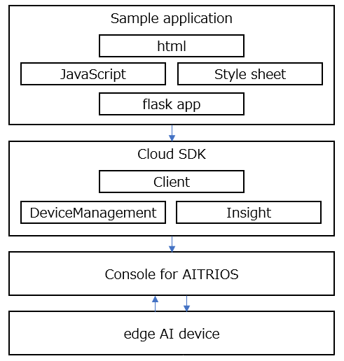
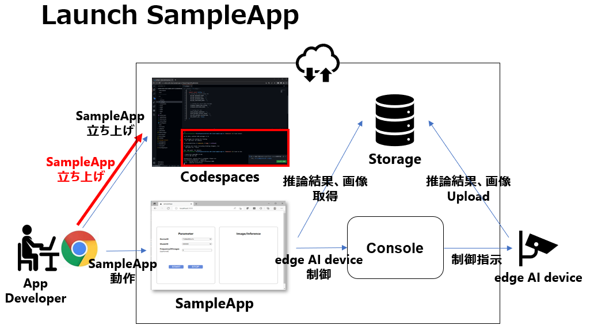
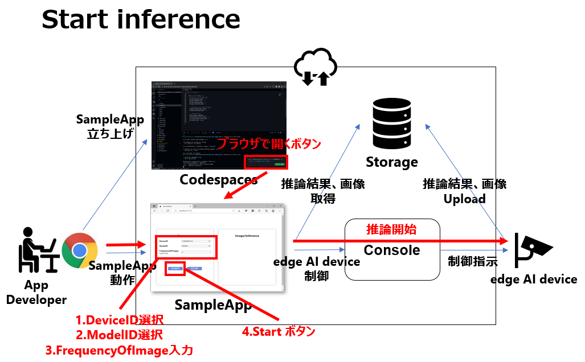
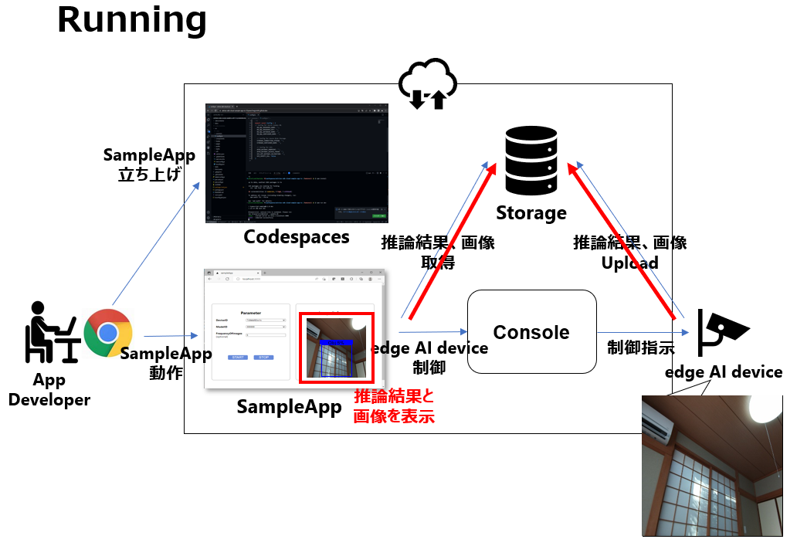
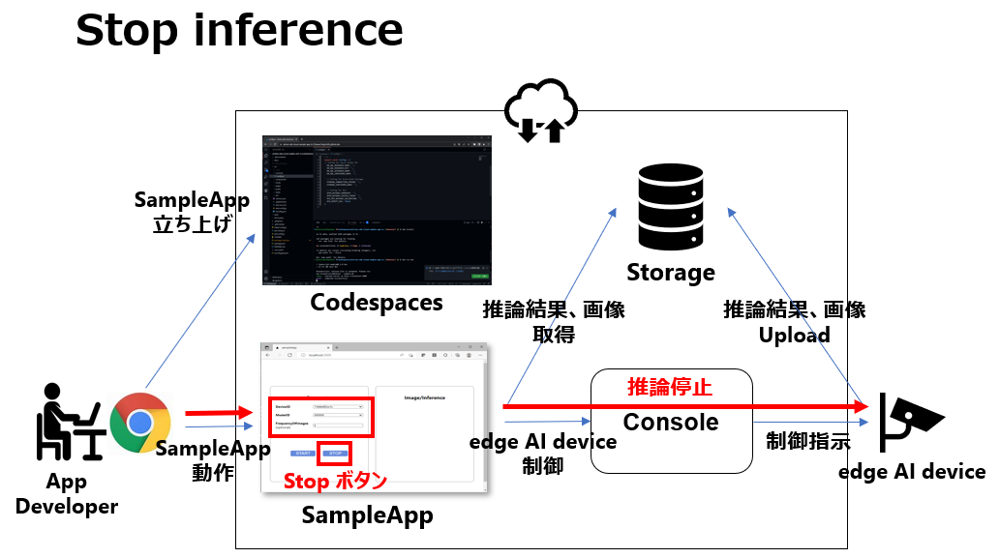

= Cloud SDK pass:[ ] サンプルアプリケーション pass:[ ] Python版 pass:[ ] チュートリアル pass:[ ] 
:sectnums:
:sectnumlevels: 1
:author: Copyright 2023 Sony Semiconductor Solutions Corporation
:version-label: Version 
:revnumber: x.x.x
:revdate: YYYY - MM - DD
:trademark-desc: AITRIOS™、およびそのロゴは、ソニーグループ株式会社またはその関連会社の登録商標または商標です。
:toc:
:toc-title: 目次
:toclevels: 1
:chapter-label:
:lang: ja

== 更新履歴

|===
|Date |What/Why 

|2022/12/12
|初版作成

|2023/1/30
|誤記修正 + 
表現統一 + 
記法修正 + 
図文字サイズ修正 + 
PDFビルド環境更新 +
サンプルアプリケーションリポジトリ構成から[console_access_settings.yaml]を削除 +
「サンプルアプリケーション実行の準備をする」の接続先情報設定方法変更 +
ユースケース毎の実装説明の「**Cloud SDK**」の0.2.0対応

|2023/5/26
|FlatBuffers version upにともなう「サンプルアプリケーションリポジトリ構成」「参考資料」修正 +
「サンプルアプリケーションが依存するPackage（フレームワーク）」にFlatBuffers不足していたため追加 +
「ユースケース毎の実装説明」のコード引用ミス修正 + 
ツール名の括弧の表記の修正 + 
図の代替テキスト追加
|===

== はじめに
このチュートリアルでは、「**Cloud SDK**」を用いたサンプルアプリケーションについて解説します。 +
このサンプルアプリケーションは、「**Cloud SDK**」の基本的な使い方を体験して頂くために用意しています。 +
サンプルアプリケーションでは、「**Cloud SDK**」を利用してエッジAIデバイスを制御する方法と、「**Console for AITRIOS**」 (以下、「**Console**」と記載)にUploadされたエッジAIデバイスの出力を確認する方法を確認できます。

[#_precondition]
== 前提条件
=== 接続情報
サンプルアプリケーションを使用するには、アプリケーションから「**Console**」へアクセスするための接続情報が必要になります。 +
取得した情報は<<#_Execute_sampleapp,「1.サンプルアプリケーション実行の準備をする」>>で利用します。 +
必要な接続情報は下記の通りです。

* クライアントアプリ詳細情報
** 「**Portal for AITRIOS**」のクライアントアプリ一覧から参照または、必要に応じてサンプルアプリケーション向けのクライアントアプリ登録を行い、下記情報の取得を行ってください。
詳細は、 https://developer.aitrios.sony-semicon.com/documents/portal-user-manual[「**Portalユーザーマニュアル**」] の「SDK用のClient Secretを発行する」をお読みください。
*** クライアントID
*** シークレット
+
** link:++https://developer.aitrios.sony-semicon.com/file/download/rest-api-authentication++[こちらのドキュメント] から下記の情報を取得してください。
*** コンソールエンドポイント
*** ポータル認証エンドポイント

=== エッジAIデバイス
サンプルアプリケーションを正常に動作させるためには、利用するエッジAIデバイスに特定の設定が必要になります。 +
必要な設定内容は下記の通りです。

* AIモデルやアプリケーションがデプロイされていること
* ベースAIモデルに、Object DetectionのAIモデルがデプロイされていること
* 「**Console**」のUIから、利用するCommand Parameter Fileを下記の設定にしておくこと
+

** Mode=1(Image&Inference Result) 
** UploadMethodIR="Mqtt" 
** AIモデルやアプリケーションの内容に応じて、その他のパラメータも変更する必要がある

== サンプルアプリケーション動作環境
https://developer.aitrios.sony-semicon.com/downloads#sdk-getting-started[「**SDK スタートガイド**」]を参照してください。

== サンプルアプリケーション機能概要
サンプルアプリケーションでは、「**Console**」に登録されたエッジAIデバイスを指定し、アプリケーションが推論結果と画像を取得するために必要な機能を実装しています。 +
実装されている機能は下記の三点です。

* 「**Console**」に登録されたエッジAIデバイスの情報取得
* エッジAIデバイスへの推論開始・停止指示
+
推論開始を行うことによって、エッジAIデバイスは推論結果・画像を「**Console**」へUploadします。
* 「**Console**」の推論結果・画像の取得、取得結果の表示

== サンプルアプリケーションリポジトリ構成
サンプルアプリケーションの動作環境は下記の通りです。 +
実装にかかわらない部分に関しては省略します。
----
aitrios-sdk-cloud-app-sample-python
├── src (1)
│   ├── __init__.py
│   ├── app.py  (2)
│   ├── common
│   │   ├── __init__.py
│   │   ├── deserialize  (3)
│   │   │   ├── __init__.py
│   │   │   ├── BoundingBox.py
│   │   │   ├── BoundingBox2d.py
│   │   │   ├── GeneralObject.py
│   │   │   ├── ObjectDetectionData.py
│   │   │   └── ObjectDetectionTop.py
│   │   ├── get_client.py  (4)
│   │   └── get_deserialize_data.py  (5)
│   ├── static
│   │   ├── css
│   │   │   ├── Home.module.css  (6)
│   │   │   └── reset.css  (7)
│   │   └── js
│   │       ├── label.json  (8)
│   │       └── sample.js  (9)
│   └── templates
│       └── index.html  (10)
----
(1) src : サンプルアプリケーション格納フォルダ +
(2) app.py : flask applicationのmain処理。各種REST APIで機能を実装 +
(3) deserialize : Deserialize用ソースコードを格納したフォルダ +
(4) get_client.py : 「**Console Access Library**」のclientを生成するmodule +
(5) get_deserialize_data.py : 推論結果をDeserializeするソースコード +
(6) Home.module.css : サンプルアプリケーションのフロントエンドスタイルシート +
(7) reset.css : サンプルアプリケーションのフロントエンドスタイルシート +
(8) label.json : 推論結果の表示ラベル +
(9) sample.js : サンプルアプリケーションのフロントエンドUIで動作するJavaScriptロジック +
(10) index.html : サンプルアプリケーションのフロントエンドUI

=== ソースコードの解説

サンプルアプリケーションの概要は下記の図のようになります。

サンプルアプリケーションはFlaskフレームワークで構成しています。

サンプルアプリケーションから「**Cloud SDK**」を呼び出し、「**Console**」を経由してエッジAIデバイスを制御します。 +
エッジAIデバイスが取得したデータは「**Console**」に保存されます。 +
サンプルアプリケーションは「**Cloud SDK**」を使用して「**Console**」からデータを取得します。

=== サンプルアプリケーションが依存するPackage（フレームワーク）

* 「**Console Access Library**」
* https://flask.palletsprojects.com/en/2.2.x/[Flask]
* https://google.github.io/flatbuffers/[FlatBuffers]

[#_Execute_sampleapp]
== サンプルアプリケーション実行方法
<<#_precondition,前提条件>>で用意した接続情報を使用します。

=== 1.サンプルアプリケーション実行の準備をする
Codespaces上から、 [src/common]配下に[console_access_settings.yaml]を作成し接続先情報を設定します。

|===
|src/common/console_access_settings.yaml
a|
[source,Yaml]
----
console_access_settings:
  console_endpoint: "コンソールエンドポイント"
  portal_authorization_endpoint: "ポータル認証エンドポイント"
  client_secret: "シークレット"
  client_id: "クライアントID"
----
|===
* `**console_endpoint**` に、取得したコンソールエンドポイントを指定します。 +
* `**portal_authorization_endpoint**` に、取得したポータル認証エンドポイントを指定します。 +
* `**client_secret**` に、登録したアプリケーションの シークレット を指定します。 +
* `**client_id**` に、登録したアプリケーションの クライアントID を指定します。 +

IMPORTANT: クライアントID と シークレット の組み合わせは、「**Console**」へのアクセス情報となります。 + 
公開したり、他者との共有をせず、取り扱いには十分注意してください。

NOTE: Proxy環境でサンプルアプリケーション実行する場合、環境変数 `**https_proxy**` の設定をしてください。

image::prepare_python_ja.png[alt="サンプルアプリケーション実行の準備をする",width="700",align="center"]

=== 2.サンプルアプリケーションを開始する
Codespacesのターミナルからpackageのインストールとサンプルアプリケーションの起動を行います。

....
$ pip install .
$ python src/app.py
....

=== 3.推論を開始する
Codespacesのポップアップからブラウザでサンプルアプリケーションを起動し、推論を開始します。

. [**DeviceID**]のリストからDevice IDを選択する
. [**START**]をクリックし、エッジAIデバイスの推論を開始する

=== 4.推論結果と画像を確認する
推論開始中は、"**Image/Inference**"エリアに画像と推論結果を表示します。

=== 5.推論を停止する
サンプルアプリケーションの[**STOP**]をクリックし、エッジAIデバイスの推論を停止します。

== ユースケース毎の実装説明

=== 1.「**Console**」に登録されたエッジAIデバイスの情報を取得する

「**Console**」を利用するために、「**Cloud SDK**」のClientを生成します。 + 
生成したClientから、「**Console**」の提供する機能を利用します。

* ライブラリインポート
+

[source,Python]
----
from console_access_library.client import Client
from console_access_library.common.config import Config
----
上記のように、「**Cloud SDK**」のClient生成に必要なライブラリをimportします。

* 「**Cloud SDK**」のClient生成
+
[source,Python]
----
def get_console_client():
  config_obj = Config(
        console_endpoint,
        portal_authorization_endpoint,
        client_id,
        client_secret
  )
  client_obj = Client(config_obj)
  return client_obj
----
上記のソースコードで、「**Cloud SDK**」のClientを生成します。 +
`**Config**` に接続情報を指定し、 `**config_obj**` を生成します。 +
`**Client**` に `**config_obj**` を指定し、 `**client_obj**` を生成します。

* デバイス情報取得
+
[source,Python]
----
def get_devices():
  client_obj = get_console_client()
  client_obj.device_management.get_devices()
----
上記のように、`**get_console_client**` を呼び出し、 `**client_obj**` を生成します。 +
`**client_obj**` の `**device_management**` が提供する `**get_devices**` を使用してデバイスの情報を取得します。

* デバイスパラメータ取得
+
[source,Python]
----
def get_command_parameter_file():
  client_obj = get_client.get_console_client()
  return client_obj.device_management.get_command_parameter_file()
----
上記のように、`**get_console_client**` を呼び出し、 `**client_obj**` を生成します。 +
`**client_obj**` の `**device_management**` が提供する `**get_command_parameter_file**` を使用してデバイスのパラメータを取得します。

=== 2.エッジAIデバイスへ推論開始を指示する

* 推論開始
+
[source,Python]
----
def start_upload_inference_result():
  client_obj = get_console_client()
  return client_obj.device_management.start_upload_inference_result(device_id="device_id")
----
上記のように、`**get_console_client**` を呼び出し、 `**client_obj**` を生成します。 +
 `**client_obj**` の `**device_management**` が提供する `**start_upload_inference_result**` を使用して推論を開始します。

=== 3.「**Console**」の推論結果・画像を取得する

「**Console**」から推論結果・画像を取得する為に、Clientが提供する機能を利用します。

* 画像リストを取得する
+
[source,Python]
----
def get_images():
  client_obj = get_console_client()
  return client_obj.insight.get_images(device_id="device_id", sub_directory_name="sub_directory_name", number_of_images=1, order_by="DESC")
----
上記のように、`**get_console_client**` を呼び出し、 `**client_obj**` を生成します。 +
`**insight**` が提供する `**get_images**` を使用して画像リストを取得します。 +

* 最新の画像を取得し、推論結果と紐付ける
+
[source,Python]
----
  client_obj = get_client.get_console_client()
  image_response = client_obj.insight.get_images(device_id, sub_dir, number_of_images=1, order_by="DESC")
  latest_image_data = "data:image/jpg;base64," + image_response["images"][0]["contents"]
  latest_image_ts = image_response["images"][0]["name"].replace(".jpg", "")
----
上記のソースコードで、画像のリストから最新の画像情報を取得します。 +
`**latest_image_data**` に、最新の画像データを取得します。 +
`**latest_image_ts**` に、最新の画像のタイムスタンプを取得します。 +
推論結果と画像はそれぞれのタイムスタンプで紐づいています。 +
`**latest_image_ts**` を使用して、画像に紐づいた推論結果の取得関数を呼び出します。

* 最新の画像に紐づく推論結果を取得する
+
[source,Python]
----
def get_inference_results():
  client_obj = get_console_client()
  inference_list = client_obj.insight.get_inference_results(device_id="device_id", number_of_inference_results=1, raw=1, time=latest_image_ts)
  return inference_list
----
上記のように、`**get_console_client**` を呼び出し、 `**client_obj**` を生成します。 +
`**insight**` が提供する `**get_inference_results**` を使用して推論結果のリストを取得します。 +
`**number_of_inference_results**` で、取得する推論結果の数を指定します。 +
`**raw**` は格納された推論結果にアクセスするための引数です。 +
`**time**` は、取得する推論結果のタイムスタンプを指定します。

* 推論結果のDeserialize
+
[source,Python]
----
deserialize_data = get_deserialize_data.get_deserialize_data(latest_inference_data)
----
上記のソースコードでは、「**Console**」から取得した推論結果を参照可能な形式へ変換する処理を行っています。 +
この変換処理の詳細について、 https://github.com/SonySemiconductorSolutions/aitrios-sdk-deserialization-sample[「Cloud SDK Deserialize サンプル」] を参照してください。

=== 4.エッジAIデバイスへの推論停止を指示する

* 推論停止
+
[source,Python]
----
def stop_upload_inference_result():
  client_obj = get_console_client()
  return client_obj.device_management.stop_upload_inference_result(device_id="device_id")
----
エッジAIデバイスの推論処理を停止するには、上記のように `**client_obj**` の `**device_management**` が提供する `**stop_upload_inference_result**` を実行します。 +
引数の `**device_id**` には、停止対象の Device ID を指定します。

== 参考資料

=== 取得した推論結果の表示（サンプルアプリケーションの表示処理）

[source,JavaScript]
----
function drawBoundingBox (image, inferenceData, labeldata) {
  const img = new window.Image()
  img.src = image
  img.onload = () => {
    const canvas = document.getElementById('canvas')
    const canvasContext = canvas.getContext('2d')
    canvas.width = img.width
    canvas.height = img.height
    canvasContext.drawImage(img, 0, 0)

    // 取得した推論結果を表示
    for (const [key, value] of Object.entries(inferenceData)) {
      if (key === 'T') {
        continue
      }
      canvasContext.lineWidth = 3
      canvasContext.strokeStyle = 'rgb(255, 255, 0)'
      // バウンディングボックスの座標を指定
      canvasContext.strokeRect(value.left, value.top, Math.abs(value.left - value.right), Math.abs(value.bottom - value.top))
      canvasContext.font = '20px Arial'
      canvasContext.fillStyle = 'rgba(255, 255, 0)'

      // ラベルを表示する座標を指定
      const labelPointX = (value.right > 270 ? value.right - 70 : value.right)
      const labelPointY = (value.bottom > 300 ? value.bottom - 10 : value.bottom)

      // ラベル、確率を表示
      canvasContext.fillText(labeldata[value.class_id] + ' ' + Math.round((value.score) * 100) + '%', labelPointX, labelPointY)
    }
  }
}
----

* 画像リストで取得される画像パスのフォーマット
+
----
<blobcontainer_name>/<device_id>/JPG/<sub_directory_name>/YYYYMMDDHHMMSSFFF.jpg
----
* 推論結果（Object Detection）のサンプルデータ + 
Inferences[]の部分が推論結果 + 
下記サンプルデータでは、2件のオブジェクト検出 +
検出結果はserializeされているが、下記サンプルデータではdeserializeされたデータ形式
+
[source,Json]
----
{
    "DeviceID": "123456789ABC",
    "ModelID": "0000000000000000",
    "Image": true,
    "Inferences": [
        {
            "1": {
                "class_id": 18,
                "score": 0.03125,
                "left": 8,
                "top": 0,
                "right": 303,
                "bottom": 107
            },
            "2": {
                "class_id": 19,
                "score": 0.02734375,
                "left": 2,
                "top": 230,
                "right": 38,
                "bottom": 319
            },
            "T": "20220101010101000"
        }
    ],
    "id": "00000000-0000-0000-0000-000000000000",
    "_rid": "AAAAAAAAAAAAAAAAAAAAAA==",
    "_self": "dbs/XXXXXX==/colls/CCCCCCCCCCCC=/docs/AAAAAAAAAAAAAAAAAAAAAA==/",
    "_etag": "\"00000000-0000-0000-0000-000000000000\"",
    "_attachments": "attachments/",
    "_ts": 1111111111
}
----
+
検出結果のパラメータは下記の通りです。
+
class_id: オブジェクトラベルのindex
+
score: オブジェクトラベルの確度
+
left: オブジェクトのX座標開始位置
+
top: オブジェクトのY座標開始位置
+
right: オブジェクトのX座標終了位置
+
bottom: オブジェクトのY座標終了位置
